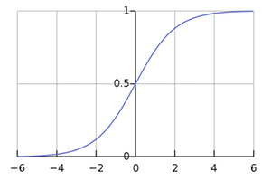
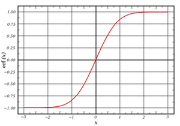
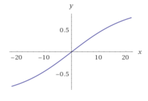
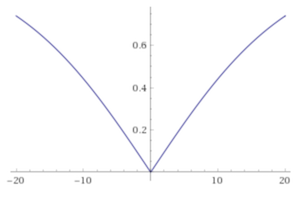
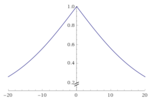
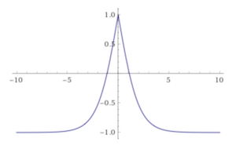

# PID Controller

#### Compiling
##### Code must compile without errors with cmake and make.

``` shell
Softwares-MacBook-Pro:tmp david$ git clone https://github.com/autohandle/CarNDPIDControlProject
Cloning into 'CarNDPIDControlProject'...
remote: Counting objects: 89, done.
remote: Compressing objects: 100% (41/41), done.
remote: Total 89 (delta 46), reused 89 (delta 46), pack-reused 0
Unpacking objects: 100% (89/89), done.
Softwares-MacBook-Pro:tmp david$ cd CarNDPIDControlProject/
Softwares-MacBook-Pro:CarNDPIDControlProject david$ mkdir build
Softwares-MacBook-Pro:CarNDPIDControlProject david$ cd build
Softwares-MacBook-Pro:build david$ cmake ..
-- The C compiler identification is AppleClang 9.0.0.9000037
-- The CXX compiler identification is AppleClang 9.0.0.9000037
-- Check for working C compiler: /Applications/Xcode.app/Contents/Developer/Toolchains/XcodeDefault.xctoolchain/usr/bin/cc
-- Check for working C compiler: /Applications/Xcode.app/Contents/Developer/Toolchains/XcodeDefault.xctoolchain/usr/bin/cc -- works
-- Detecting C compiler ABI info
-- Detecting C compiler ABI info - done
-- Detecting C compile features
-- Detecting C compile features - done
-- Check for working CXX compiler: /Applications/Xcode.app/Contents/Developer/Toolchains/XcodeDefault.xctoolchain/usr/bin/c++
-- Check for working CXX compiler: /Applications/Xcode.app/Contents/Developer/Toolchains/XcodeDefault.xctoolchain/usr/bin/c++ -- works
-- Detecting CXX compiler ABI info
-- Detecting CXX compiler ABI info - done
-- Detecting CXX compile features
-- Detecting CXX compile features - done
-- Configuring done
-- Generating done
-- Build files have been written to: /tmp/CarNDPIDControlProject/build
Softwares-MacBook-Pro:build david$ make
Scanning dependencies of target pid
[ 33%] Building CXX object CMakeFiles/pid.dir/src/PID.cpp.o
/tmp/CarNDPIDControlProject/src/PID.cpp:83:1: warning: control reaches end of non-void function [-Wreturn-type]
}
^
1 warning generated.
[ 66%] Building CXX object CMakeFiles/pid.dir/src/main.cpp.o
/tmp/CarNDPIDControlProject/src/main.cpp:58:18: warning: unused variable 'angle' [-Wunused-variable]
          double angle = std::stod(j[1]["steering_angle"].get<std::string>());
                 ^
1 warning generated.
[100%] Linking CXX executable pid
ld: warning: directory not found for option '-L/usr/local/Cellar/libuv/1.11.0/lib'
[100%] Built target pid
Softwares-MacBook-Pro:build david$ ./pid
Listening to port 4567
^C
Softwares-MacBook-Pro:build david$
```

#### Implementation
##### The PID procedure follows what was taught in the lessons

The algorithm is implemented in
[PID.cpp](https://github.com/autohandle/CarNDPIDControlProject/blob/master/src/PID.cpp) and [PID.h](https://github.com/autohandle/CarNDPIDControlProject/blob/master/src/PID.h) in the class [CarControl](https://github.com/autohandle/CarNDPIDControlProject/blob/590473f6dcaee40b02275dbb96be24f5be064f0f/src/PID.cpp#L115-L132). [CarControl](https://github.com/autohandle/CarNDPIDControlProject/blob/590473f6dcaee40b02275dbb96be24f5be064f0f/src/PID.cpp#L115-L132) is both initialized
``` C++
CarControl carControl;
```
and called by [main.cpp](https://github.com/autohandle/CarNDPIDControlProject/blob/master/src/main.cpp) in the event [on_message](https://github.com/autohandle/CarNDPIDControlProject/blob/590473f6dcaee40b02275dbb96be24f5be064f0f/src/main.cpp#L42-L88).
``` C++
const double* carControls=carControl.Update(cte, speed);
steer_value=*carControls;
throttle=carControls[1];
// DEBUG
std::cout << "CTE: " << cte << " Steering Value: " << steer_value << ", throttle:" << throttle << std::endl;
```
[CarControl](https://github.com/autohandle/CarNDPIDControlProject/blob/590473f6dcaee40b02275dbb96be24f5be064f0f/src/PID.cpp#L115-L132) returns an updated control value for both the `steer_value` and the `throttle` value to be sent to the simulator.

[CarControl::Update](https://github.com/autohandle/CarNDPIDControlProject/blob/590473f6dcaee40b02275dbb96be24f5be064f0f/src/PID.cpp#L124-L132) 
delegates the steering update to one PID controller and the throttle/speed update to another,
``` C++
double steering=(*steeringPID).Update(theCTE);
double speed=(*throttlePID).Update(theCTE);
static double controls[2];
controls[0]=steering;
controls[1]=speed;
if (DEBUGPRINT) std::cout << "CarControl-steering:" << controls[0] << ", speed:" << controls[1] << std::endl;
return controls;
```
and then returns the control updates to `main`. The PID controllers were initialized in the [CarControl::CarControl](https://github.com/autohandle/CarNDPIDControlProject/blob/2b1cd0f2237d983be191b6bb04ea4b0fa7ef4d8d/src/PID.cpp#L115-L119) constructor.
``` C++
CarControl::CarControl() :  steeringPID(new PID(*(new P1M1SlopedSigmoid(0.207)))),
throttlePID(new ThrottlePID(*(new P1M1SlopedSigmoid(.095)/* throttle between 0 & 1*/), 1. /* speed reference */)) {
  (*steeringPID).Init(1.1/* Kp */, .00001 /* Ki */, 21. /* Kd */);//
  (*throttlePID).Init(10./* Kp */, 0. /* Ki */, 100. /* Kd */);//
}
```
The streering PID update, [PID::Update](https://github.com/autohandle/CarNDPIDControlProject/blob/590473f6dcaee40b02275dbb96be24f5be064f0f/src/PID.cpp#L54-L80), implements the 3 parameter controller discussed in class:
``` C++
const double newControl =  -kP * theControlSignal \
                        -kD *  differentialControlSignal \
                        -kI * sumOfAllControlSignals;

...

const double sigmoidControl = sigmoid.getValue(newControl);
```
The `newControl` value is clamped by using a [sigmoid](https://github.com/autohandle/CarNDPIDControlProject/blob/590473f6dcaee40b02275dbb96be24f5be064f0f/src/PID.h#L24-L40)
<br>

<br>
whose range has been [adjusted](https://github.com/autohandle/CarNDPIDControlProject/blob/590473f6dcaee40b02275dbb96be24f5be064f0f/src/PID.h#L64-L81) between -1 and 1
<br>


The throttle PID control is given a `speedReference` in the constructor: [ThrottlePID::ThrottlePID](https://github.com/autohandle/CarNDPIDControlProject/blob/2b1cd0f2237d983be191b6bb04ea4b0fa7ef4d8d/src/PID.cpp#L85-L86)
``` C++
ThrottlePID::ThrottlePID(Sigmoid &theSigmoid, const double theSpeedReference) : PID(theSigmoid), speedReference(theSpeedReference) {
}
```
The intuition for [ThrottlePID::Update](https://github.com/autohandle/CarNDPIDControlProject/blob/2b1cd0f2237d983be191b6bb04ea4b0fa7ef4d8d/src/PID.cpp#L88-L98) is that, if the cross reference signal is 0, then the throttle should be increased toward the maximum (i.e. 1.0). The further away from 0, the lower the throttle should be, giving the steering control more time and distance to correct `theCrossTrackingError` of the car.
``` C++
const double /* throttle */ ThrottlePID::Update(const double theCrossTrackingError) {// throttle between 0 & 1
  double pidControl=PID::Update(theCrossTrackingError);// -1 -> +1
  double throttleFactor=1.-abs(pidControl);// abs: +1 -> 0 -> +1 // 1-abs: 0 -> +1 -> 0
  double newSpeed=throttleFactor*speedReference;
  return newSpeed;
}
```
Implementing the intuition, [ThrottlePID::Update](https://github.com/autohandle/CarNDPIDControlProject/blob/2b1cd0f2237d983be191b6bb04ea4b0fa7ef4d8d/src/PID.cpp#L88-L98) obtains the three parameter sigmoid PID signal clamped between 0 and 1, just like steering does, from [PID::Update](https://github.com/autohandle/CarNDPIDControlProject/blob/590473f6dcaee40b02275dbb96be24f5be064f0f/src/PID.cpp#L54-L80)  using `theCrossTrackingError` 
<br>

<br>
The absolute value of the [PID::Update](https://github.com/autohandle/CarNDPIDControlProject/blob/590473f6dcaee40b02275dbb96be24f5be064f0f/src/PID.cpp#L54-L80) is calculated because only the value of the [PID::Update](https://github.com/autohandle/CarNDPIDControlProject/blob/590473f6dcaee40b02275dbb96be24f5be064f0f/src/PID.cpp#L54-L80) signal makes a difference.
<br>

<br>
Then the [PID::Update](https://github.com/autohandle/CarNDPIDControlProject/blob/590473f6dcaee40b02275dbb96be24f5be064f0f/src/PID.cpp#L54-L80) signal is subtracted from 1.0, in order to move the throttle toward 0 when the `theCrossTrackingError` is offset from 0 and 1 when it is not and there is no cross tracking error.
<br>

<br>
Then the `throttleFactor`, now between 0 and 1, multiplies the `speedReference`, which is also fixed between 0 and 1 when passed in the constructor, giving the `newSpeed`. The `newSpeed` is return to the caller, [CarControl::Update](https://github.com/autohandle/CarNDPIDControlProject/blob/590473f6dcaee40b02275dbb96be24f5be064f0f/src/PID.cpp#L124-L132), which sets the `throttle` for the car.

#### Reflection
##### The effect each of the P, I, D components

The PID controllers were initialized in the [CarControl::CarControl](https://github.com/autohandle/CarNDPIDControlProject/blob/2b1cd0f2237d983be191b6bb04ea4b0fa7ef4d8d/src/PID.cpp#L115-L119) constructor.
``` C++
CarControl::CarControl() :  steeringPID(new PID(*(new P1M1SlopedSigmoid(0.207)))),
throttlePID(new ThrottlePID(*(new P1M1SlopedSigmoid(.095)/* throttle between 0 & 1*/), 1. /* speed reference */)) {
  (*steeringPID).Init(1.1/* Kp */, .00001 /* Ki */, 21. /* Kd */);//
  (*throttlePID).Init(10./* Kp */, 0. /* Ki */, 100. /* Kd */);//
}
```
The PID values were roughly set from the homework and then the minimum and maximum values were tracked in [PID::recordExtremes](https://github.com/autohandle/CarNDPIDControlProject/blob/2b1cd0f2237d983be191b6bb04ea4b0fa7ef4d8d/src/PID.cpp#L21-L27).
``` C++
const void PID::recordExtremes(const double theControlSignal, const double theDifferentialControlSignal) {
  maximumControlSignal=max(maximumControlSignal,theControlSignal);
  minimumControlSignal=min(minimumControlSignal,theControlSignal);

  maximumDifferentialControlSignal=max(maximumDifferentialControlSignal,theDifferentialControlSignal);
  minimumDifferentialControlSignal=min(maximumDifferentialControlSignal,theDifferentialControlSignal);
}
```
###### Steering
If the car is going very slow, then steering for the track would approximate a straight line and the most significant factor would be the correction for the cross track error. If the car has some speed, then the track curvature becomes significant and the differential error needed to have the same level of effect as the cross track error. Typical values for the steering cross track error varied from +10 to -10 and for the differential error from +1 to -1. The parameter for the cross track error and the dfferential error reflect this order of magnitude difference. The cross track error parameter is around 1. and the differential error is around 20. Since the track curves significantly back and forth, the integration parameter is not significant for correcting an inherent bias.
###### Throttle
The intuition for [ThrottlePID::Update](https://github.com/autohandle/CarNDPIDControlProject/blob/2b1cd0f2237d983be191b6bb04ea4b0fa7ef4d8d/src/PID.cpp#L88-L98) is that, if the cross reference signal is 0, then the throttle should be increased toward the maximum (i.e. 1.0). The further away from 0, the lower the throttle should be, giving the steering control more time and distance to correct `theCrossTrackingError` of the car.

Again, typical values for the steering cross track error varied from +10 to -10 and for the differential error from +1 to -1. The parameter for the cross track error and the dfferential error reflect the order of magnitude difference. The cross track error parameter is around 10. and the differential error is around 100. Since the track curves significantly back and forth, the integration parameter is not significant for correcting an inherent bias.

##### Describe how the final hyperparameters were chosen.

The initial PID values were selected by setting the veocity very low, so that the track would approximate a straight line. At low speeds, the approximate parameters in the homework were effective.

After the car was staying on the track, then the minimum and maximum values were tracked in [PID::recordExtremes](https://github.com/autohandle/CarNDPIDControlProject/blob/2b1cd0f2237d983be191b6bb04ea4b0fa7ef4d8d/src/PID.cpp#L21-L27). These values were printed and
``` C++
// stable    throttle:0.4 maxCTE:4.6634, minCTE:-2.281 , maxdCTE:1.0997, mindCTE:-0.0002
// stable    throttle:0.8 Ks:1.,.001,50. Kt:0,0,100 maxCTE:4.7047,minCTE:-2.9494,maxdCTE:0.6007, mindCTE:0.0358
// stable    throttle:0.8 Ks:2.,.001,50. Kt:0,0,100 maxCTE:5.197,minCTE:-2.4486,maxdCTE:0.9299, mindCTE:-0.1169
// unstable  throttle:0.8 Ks:.5,.001,50. Kt:0,0,100 maxCTE:9.4153,minCTE:-3.985,maxdCTE:1.0062, mindCTE:-0.0637
// stable    throttle:0.8 Ks:1.,.001,25. Kt:0,0,100 maxCTE:3.3424,minCTE:-3.4471,maxdCTE:0.4412, mindCTE:0.0411
// unstable  throttle:0.8 Ks:1.,.001,15. Kt:0,0,100 maxCTE:6.0274,minCTE:-6.272,maxdCTE:1.4978, mindCTE:-0.0074
// stable    throttle:0.8 Ks:1.,.001,20. Kt:0,0,100 maxCTE:3.5335,minCTE:-3.7681,maxdCTE:1.7446, mindCTE:0.0561
// unstable  throttle:0.8 Ks:1.,.001,30. Kt:0,0,100 maxCTE:24.1299,minCTE:-3.637,maxdCTE:0.9075, mindCTE:-0.2219
// stableX   throttle:0.8 Ks:1.,.001,25. Kt:0,0,100 maxCTE:3.3424,minCTE:-3.4471,maxdCTE:0.4412, mindCTE:0.0411
// stable    throttle:0.8 Ks:.9,.001,25. Kt:0,0,100 maxCTE:3.4722,minCTE:-3.5238,maxdCTE:0.5117, mindCTE:-0.0364
// stable    throttle:0.8 Ks:.9,.001,25. Kt:1,0,100 maxCTE:3.8671,minCTE:-3.566, maxdCTE:1.5902, mindCTE:-0.0082
// stable    throttle:0.8 Ks:.9,.001,25. Kt:2,0,100 maxCTE:3.4327, minCTE:-3.8073, maxdCTE:2.099, mindCTE:0.0036
// stable    throttle:0.8 Ks:.9,.001,25. Kt:2,0,100 maxCTE:3.8947, minCTE:-3.7933, maxdCTE:1.279, mindCTE:-0.0138
// stable    throttle:0.8 Ks:.9,.001,25. Kt:2,0,100 maxCTE:3.4584, minCTE:-3.9159, maxdCTE:0.8101, mindCTE:-0.0664
```
were used to inform the selection of the PID parameters. Since a sigmoid was used to clamp the PID control value between 0 and 1, and additional parameter was the slope of the sigmoid which was set in the [CarControl::CarControl](https://github.com/autohandle/CarNDPIDControlProject/blob/2b1cd0f2237d983be191b6bb04ea4b0fa7ef4d8d/src/PID.cpp#L115-L119) constructor. All of the parameters were set by using trial and error hand-held gradient descent.

#### Simulation

The video of the car with the parameters in the checked-in code:
[PID Controller](https://s3.amazonaws.com/autohandle.com/video/CarNDPIDControlProject100.mp4)

Too late in the project, I discovered that a negative throttle would apply the brakes, so I changed the clamp for the throttle to vary from -1 to +1
<br>

<br>
Thr car is now a bit more aggresive and skids around the first turn after the bridge with the brakes on:
[Braking PID Controller](https://s3.amazonaws.com/autohandle.com/video/CarNDPIDControlProjectBraking.mp4)


The video was created by using a [screen recording tool](http://www.idownloadblog.com/2016/02/26/how-to-record-part-of-mac-screen-quicktime/).

